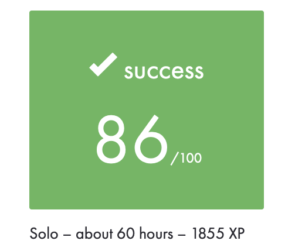

# push_swap 86/100
This is my solution for the push_swap project of 42 school.<br>
<br>
<br>

## This code is capable of
- handeling inputs that look like `"2 1 3 4 5"` or `2 1 3 4 5` or `2 1 "3 4 5"`<br>
- detecting a non-numeric, greater or smaller than integer or double number input<br>
- sorting 3 random integers in 1 or 2 actions<br>
- sorting 5 random integers in 5 to 10 actions<br>
- sorintg 100 random integers with an average of ca. 757 actions<br>
- sorting 500 random integers with an average of ca. 7248 actions<br>
(both average amount of actions where the average of 1000 random tests)<br>

## This code is not capable of
- sorting 6-45 random integers with a 100% success rate<br>
(with 45 random integers the success-rate is 99.9% when testing 1000 different cases)<br>

## explanation of my algorithm

### 100 number sort(ft_big_sort)
For 100 Numbers i split my stack into 4 parts.<br>
- Step 1: Find the corresponding borders to split my stack into 4 parts, equal in size.<br>
- Step 2: push the first quarter to stack B<br>
- Step 3: search for the biggest and the smallest number in stack B<br>
- Step 4: rotate the biggest number to the top of stack B and push it to stack A<br>
- Step 5: rotate the smallest number to the top of stack B, push it to stack A and rotate it to the bottom<br>
- Step 6: repeat steps 4 and 5 until stack B is empty<br>
- Step 7: rotate all my sorted numbers from the top of stack A to the bottom of stack A<br>
- Step 8: repeat steps 2 to 7 for the remaining quarters<br>
- Step 9: have your numbers sorted by ascending order in stack A, with the smallest number on top of your Stack<br>

### 500 number sort(ft_big_big_sort)
This works very similar to the 100 number sort, but instead of splitting my stack into quarters i split it into eighths.<br>
## how to use the algorithm
This will compile my code into an executable called `push_swap` and delete all unnecesarry files that were created during compilation.<br>

```
make call
```

To use the visualizer i used in the example below.<br>
This visualizer is not mine, you can find it [here](https://github.com/o-reo/push_swap_visualizer "github.com/o-reo/push_swap_visualizer").

```
python3 pyviz.py `ruby -e "puts (1..50).to_a.shuffle.join(' ')"`
```

## visualization of my algorithm sorting 50 random integers
<br>
